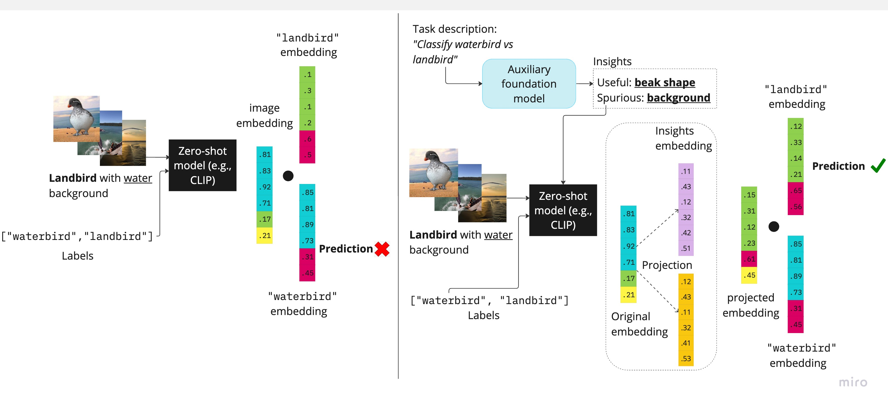

# Roboshot

This repository contains the code implementation of ICLR 2024 paper: Zero-Shot Robustification of Zero-Shot Models (RoboShot) [paper link](https://arxiv.org/pdf/2309.04344).

<div style="width: 50%; height: 50%">
  
  
  
</div>

### Downloading datasets: ###
- WILDS datasets (Waterbirds, CelebA): The code enables automatic download of WILDS datasets (thanks to the amazing [WILDS benchmark package](https://wilds.stanford.edu/)!). No extra steps needed here!
- DomainBed datasets (PACS, VLCS): Download the datasets from [DomainBed suit](https://github.com/facebookresearch/DomainBed)
- CXR:

### Environment setup: ###
1. Create new conda environment 
```bash
conda create -n roboshot python=3.7
conda activate roboshot
```
2. Install required packages
```bash
bash env.sh
```

### We're almost there! just a couple more utility steps: ###
1. Put in the `absolute` path of to download your datasets in `utils/sys_const.py` under the `DATA_DIR` constant.
2. We have a cached ChatGPT concepts that you can use directly without calling the API. However, if you wish to run the full pipeline from scratch and getting fresh concept from ChatGPT, you should:
    - Get [OpenAI API key](https://openai.com/blog/openai-api)
    - Create `api_key.py` in the `utils` directory
    - Paste the following code:
    ```bash
    API_KEY = [your API key string here]
    ```
3. If you wish to use LLaMA, download its weights [here](https://docs.google.com/forms/d/e/1FAIpQLSfqNECQnMkycAp2jP4Z9TFX0cGR4uf7b_fBxjY_OjhJILlKGA/viewform) and follow the instructions from HuggingFace [here](https://huggingface.co/docs/transformers/main/model_doc/llama). Then, tut in the `absolute` path to your LLaMA weights in `utils/sys_const.py` under the `LLAMA_PATH` constant.
### Running the code ###
Now we are ready to run the code!
```bash
python run.py -d=waterbirds -reuse
```
Flags:
- `-d`: select dataset (waterbirds/celebA/pacs/cxr/vlcs)
- `-clip`: select CLIP model (align/alt/openclip_vitl14/openclip_vitb32/openclip_vith14)
- `-lm`: select LLM to extract insights (chatgpt/llama/gpt2/flan-t5)
- `-reuse`: reuse the cached ChatGPT output
